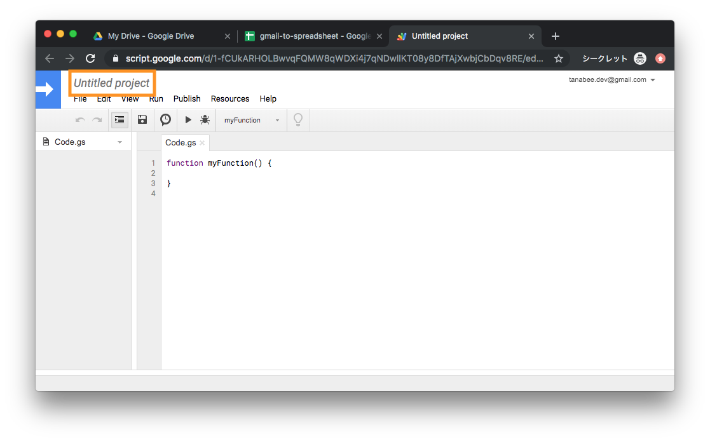
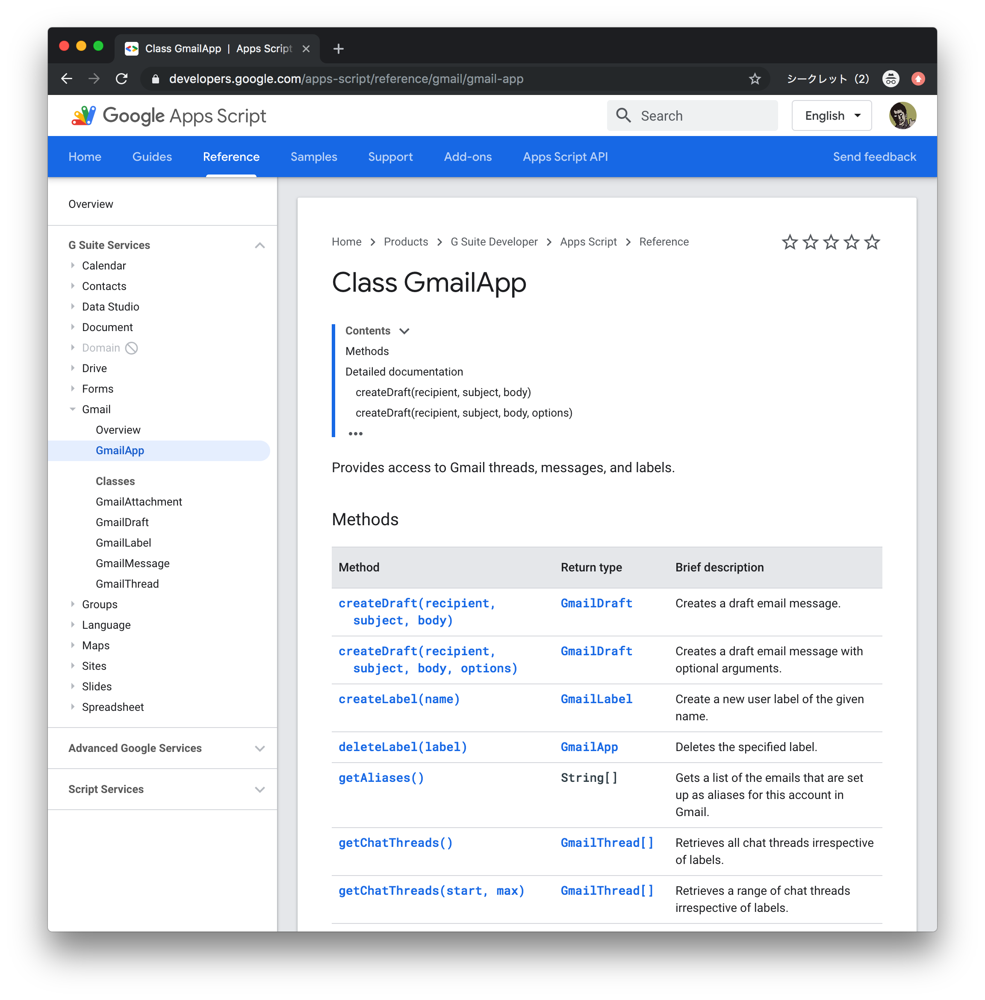
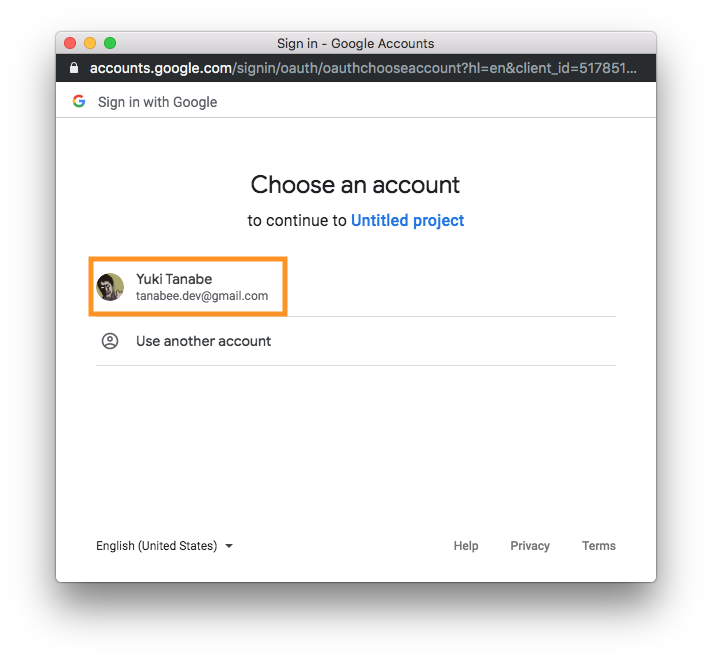
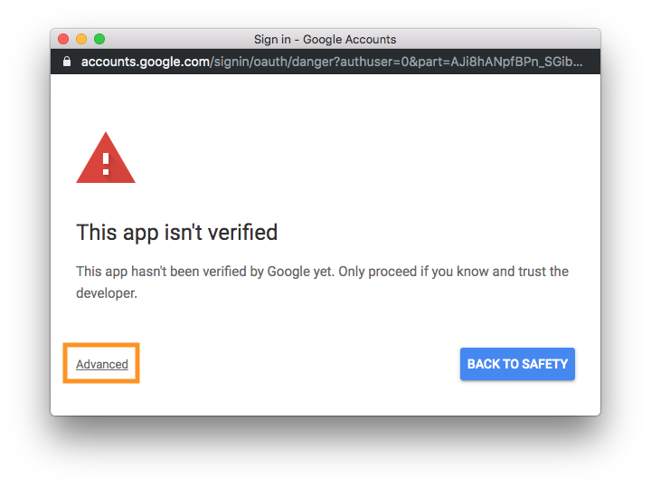
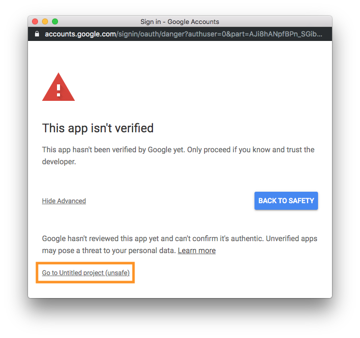
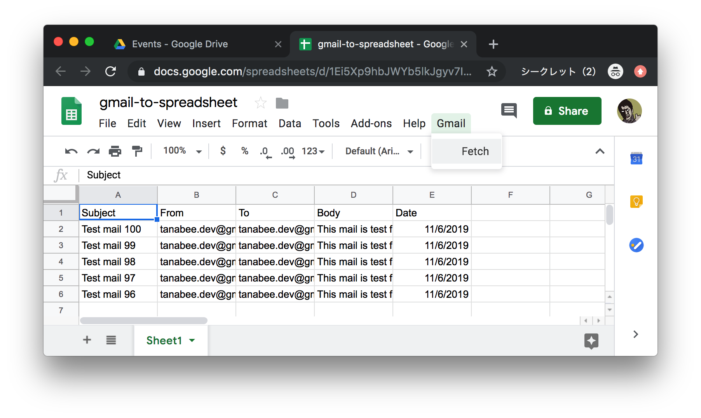
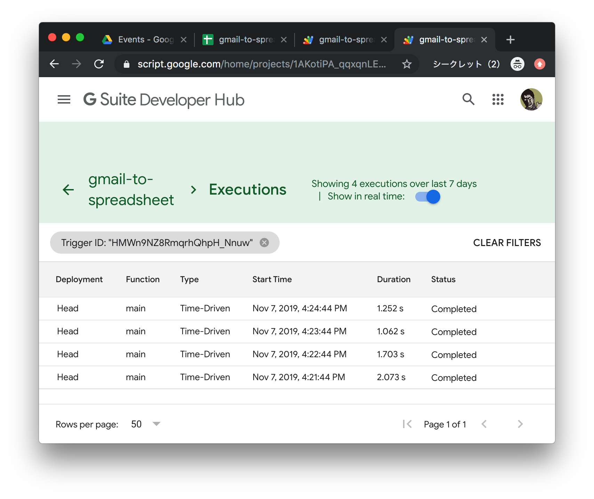

author: Yuki Tanabe
summary: Apps Script Hands-on
id: ja
categories: apps-script,gsuite,javascript
environments: Web
status: Draft
analytics account: UA-141719032-2
feedback link: https://github.com/tanabee/gas-codelab/issues

# Apps Script Hands-on

## Intro

この Codelab では、 Google Apps Script を用いて Gmail のメッセージ一覧を Google Spreadsheet に抽出するアプリケーションを作成します。


### 対象者

- Google Apps Script 初心者
- JavaScript 経験者

### ユースケース

この Codelab は以下のようなケースを想定しています。

- 特定のメーリス、もしくはメールアドレスへのユーザーからの問い合わせの集計、分析
- REST API は提供していないがメール通知機能を提供しているアプリケーションとのシステム連携

## 準備

Gmail もしくは G Suite のアカウントが必要です。もしまだアカウントがない場合には [Gmail アカウントを作成](https://accounts.google.com/signup)してください。

Negative
: Gmail アカウントを作成した場合には、以下の手順に沿ってください。

### 1. mail-to-me アプリケーションを開く

[mail-to-me](https://script.google.com/d/1p2B0NwXg3APMc-nh-fRWuMX6P_W5eQijsi4CVEHLOOq7_zJmQbWyZAWl/edit?usp=sharing) アプリケーションをブラウザで開く。

### 2. コピーを作成

**File** > **Make a Copy** を選択。

### 3. mail-to-me の実行

**Run** ボタンをクリック。

### 4. Gmail を確認

[Gmail](https://mail.google.com) をブラウザで開き、メールが受信されていることを確認する。以上で準備は完了です。

## プロジェクトの作成

Apps Script のプロジェクトを作成しましょう。まず [drive.google.com](https://drive.google.com) にアクセスし、スプレッドシートファイルを作成します。


**New** をクリック


**Google Sheets** を選択するとスプレッドシートファイルが作成されます。


ファイル名を選択し、ファイル名（gmail-to-spreadsheet など）を入力します。


**Tools** > **Script editor** メニューを選択すると Google Apps Script プロジェクトが作成されます。


プロジェクト名を選択し、プロジェクト名（gmail-to-spreadsheet など）を入力します。


プロジェクト名を入力して OK ボタンをクリックするとプロジェクトが保存されます。トーストが表示されてから、非表示になったところで保存が完了します。

これでスクリプトを実行できるようになりました。次のセクションでスクリプトを実行していきます。

## スクリプトの実行

Copy the script below and paste to the Script editor, and click **Run** button.

```JavaScript
function main() {
  Logger.log('Hello Google Apps Script!');
}
```


`Logger.log()` is logging function in Google Apps Script.


You can view logs when you select **View** > **Logs** in the menu.


We can find the text `Hello Google Apps Script!` in Log Viewer.

We can also use `console.log()`, but we use `Logger.log()` in this Hands-on because you need an additional process to use `console.log()`.

## GmailApp class

Next, let's understand GmailApp class. Confirm GmailApp classes and methods in [official reference](https://developers.google.com/apps-script/reference/). See [GmailApp document](https://developers.google.com/apps-script/reference/gmail/gmail-app). You can see GmailApp classes (e.g. [GmailMessage](https://developers.google.com/apps-script/reference/gmail/gmail-message), [GmailThread](https://developers.google.com/apps-script/reference/gmail/gmail-thread) ) and methods (e.g. [search](https://developers.google.com/apps-script/reference/gmail/gmail-app#searchquery,-start,-max), [sendEmail](https://developers.google.com/apps-script/reference/gmail/gmail-app#sendemailrecipient,-subject,-body,-options)) 



We use [search](https://developers.google.com/apps-script/reference/gmail/gmail-app#searchquery,-start,-max) method for retrieving emails in this time.

## Retrieve Gmail threads

Let's implement the script. Use `GmailApp.search` method and retrieve Gmail threads.

```JavaScript
function main() {
  var searchText = '';// You can set value.
  var threads = GmailApp.search(searchText, 0, 5);
  Logger.log(threads);
}
```

If you would like to apply search filters, you can assign value to searchText. You can confirm search operators [here](https://support.google.com/mail/answer/7190?hl=en).

Click **Run** button.


Then an authentication popup will be shown. You need to allow this project to access Gmail resources. Click **Review Permissions**.


Choose an account that you are using in this codelab.



To verify this app, click **Advanced** and click the bottom link **Go to ...**. If it doesn't be displayed, skip this step.


Then the scope you need to allow is displayed. Click **Allow** button. It will go back to Script editor and run the script.


See the logs. Then you can see Array of GmailThread. You succeeded to retrieve emails for only 5 lines of code! Because of this popup authentication flow, you don't need to implement authentication codes and you can make it easier than ever.

## Parse Gmail messages

In the previous section, we could retrieve Gmail threads. We'd like to retrieve the message subject, body, from, to, and date in this time. So, we need to get messages from `GmailThread`.


Visit Apps Script reference. GmailThread class has [getMessages()](https://developers.google.com/apps-script/reference/gmail/gmail-thread#getmessages) method and it returns Array of GmailMessage. Click **GmailMessagge** link and see the methods.


it has getSubject, getBody, getFrom, getTo, getDate and many retrieving methods. We can get values we want using `GmailThread.getMessages()`.

In this time, we use the first message of the threads. Retrieve message and show logs.

```JavaScript
function main() {
  var searchText = '';
  var threads = GmailApp.search(searchText, 0, 5);
  threads.forEach(function (thread) {
    var message = thread.getMessages()[0];
    Logger.log(message);
  });
}
```


You can see the text **GmailMessage** in log viewer.

Finaly, get values to call methods.

```JavaScript
function main() {
  var searchText = '';
  var threads = GmailApp.search(searchText, 0, 5);
  threads.forEach(function (thread) {
    var message = thread.getMessages()[0];
    Logger.log(message.getSubject());
    Logger.log(message.getFrom());
    Logger.log(message.getTo());
    Logger.log(message.getPlainBody());
    Logger.log(message.getDate());
  });
}
```


Run the script and See the logs. You succeeded to retrieve Gmail message values! From Next section, we will insert these values to Spreadsheet.

## SpreadsheetApp class

// TODO: Graph: Spreadsheet > Sheet > Range 

Next, let's understand SpreadsheetApp class. Visit [SpreadsheetApp reference](https://developers.google.com/apps-script/reference/spreadsheet/spreadsheet-app) and see [getActiveSheet](https://developers.google.com/apps-script/reference/spreadsheet/spreadsheet-app#getactivesheet) method section. You can access the Spreadsheet you created to use this method.

Run this method below. You need to allow the authentication just like in Gmail.

```JavaScript
function saveMessages() {
  Logger.log(SpreadsheetApp.getActiveSheet().getName());
}
```


You can see the Spreadsheet tab name in the log viewer. You need to access [Range](https://developers.google.com/apps-script/reference/spreadsheet/range) class to insert data into the sheet. Use [Range.setValues()](https://developers.google.com/apps-script/reference/spreadsheet/range#setvaluesvalues) to insert messages.

```JavaScript
function saveMessages() {
  var data = [
    ['a', 'b', 'c'],
    ['d', 'e', 'f'],
  ];
  SpreadsheetApp
    .getActiveSheet()
    .getRange("A1:C2")
    .setValues(data);
}
```


Run this method and See the Spreadsheet. You can see the value is inserted into the sheet. Note that the argument must be a two-dimensional array.

Then, update this method to set data as argument of this method. We'd like to insert 5 type of values, so we set the last column to "E".

```JavaScript
function saveMessages(data) {
  SpreadsheetApp
    .getActiveSheet()
    .getRange("A1:E" + data.length)
    .setValues(data);
}
```

Add test method and Run it.

```JavaScript
function test() {
  var data = [
    ['a', 'b', 'c', 'd', 'e'],
    ['f', 'g', 'h', 'i', 'j'],
    ['A', 'B', 'C', 'D', 'E'],
    ['F', 'G', 'H', 'I', 'J'],
  ];
  saveMessages(data);
}
```


Done! Now, you can delete test method. We will call `saveMessages function` from `main function` from the next section.

## Save emails to Spreadsheet

Update main function to call `saveMessages` function. Make messages variable as two-dimensional array.

```JavaScript
function main() {
  var searchText = '';
  var threads = GmailApp.search(searchText, 0, 5);
  var messages = [];
  threads.forEach(function (thread) {
    var message = thread.getMessages()[0];
    // single cell characters limit
    if (message.getPlainBody().length > 50000) {
      return;
    }
    messages.push([
      message.getSubject(),
      message.getFrom(),
      message.getTo(),
      message.getPlainBody(),
      message.getDate(),
    ]);
  });
  saveMessages(messages);
}

function saveMessages(data) {
  SpreadsheetApp
    .getActiveSheet()
    .getRange("A1:E" + data.length)
    .setValues(data);
}
```

Run `main` function and see the Spreadsheet.


You can see the messages data in Spreadsheet! Although, it is better that the first row is filled column name. Replace 4th row as below and run the script.

```JavaScript
  var messages = [['Subject', 'From', 'To', 'Body', 'Date']];
```


We can understand the column means well. Now, we succeeded to make the application that can connect Gmail and Spreadsheet, and it is only -30 lines of code.

## Custom Menu of Spreadsheet

The application we made works well, but we can make it more convenient. We will add custom menu on Spreadsheet. Add the `onOpen` function below and Run it. The name `onOpen` is reserved and will be called when the Spreadsheet is opened. You can confirm in the [document](https://developers.google.com/apps-script/guides/triggers#onopene).

```JavaScript
function onOpen() {
  SpreadsheetApp
    .getActiveSpreadsheet()
    .addMenu('Gmail', [
      {name: 'Fetch', functionName: 'main'},
    ]);
}
```



See the Spreadsheet. The custom menu will be displayed. Click **Gmail** > **Fetch**.

It's better that it can be operated to reset the sheet values. Add `clearSheet` function and add menu.

```JavaScript
function onOpen() {
  SpreadsheetApp
    .getActiveSpreadsheet()
    .addMenu('Gmail', [
      {name: 'Fetch', functionName: 'main'},
      {name: 'Clear sheet', functionName: 'clearSheet'},
    ]);
}

function clearSheet() {
  SpreadsheetApp
    .getActiveSheet()
    .clear();
}
```

You can see **Clear sheet** sub menu and run it.

## Automation

You can also configure automation to this project using [Trigger](https://developers.google.com/apps-script/guides/triggers/installable). Let's try setting [Time-driven trigger](https://developers.google.com/apps-script/guides/triggers/installable#time-driven_triggers) to run the `main` function once a minute.

Follow below.


Select **Edit** > **Current project's trigger**


Select **Add Trigger**


Then it will be displayed the popup of trigger settings. Select as screenshot and Click Save.


Then the trigger is created. Click the dot icon.


Select **Executions**.


You can see that function is called once a minute. If you caught new message, you can keep up-to-date.


You can delete trigger to select the dot icon and **Delete trigger**.


Google Apps Script has many types of triggers. You can improve the projects more convenient.

## Congrats!

Congrats! You finished this codelab. You can see the final project code below.

```JavaScript
function onOpen() {
  SpreadsheetApp
    .getActiveSpreadsheet()
    .addMenu('Gmail', [
      {name: 'Fetch', functionName: 'main'},
      {name: 'Clear sheet', functionName: 'clearSheet'},
    ]);
}

function main() {
  var searchText = '';
  var threads = GmailApp.search(searchText, 0, 500);
  var messages = [['Subject', 'From', 'To', 'Body', 'Date']];
  threads.forEach(function (thread) {
    var message = thread.getMessages()[0];
    // single cell characters limit
    if (message.getPlainBody().length > 50000) {
      return;
    }
    messages.push([
      message.getSubject(),
      message.getFrom(),
      message.getTo(),
      message.getPlainBody(),
      message.getDate(),
    ]);
  });
  saveMessages(messages);
}

function saveMessages(data) {
  clearSheet();
  SpreadsheetApp
    .getActiveSheet()
    .getRange("A1:E" + data.length)
    .setValues(data);
}

function clearSheet() {
  SpreadsheetApp
    .getActiveSheet()
    .clear();
}
```

### Next Action

You can improve this project. I'll show you some examples.

- Retrieve Over 500 Gmail threads (Using for statement)
- Not overwrite but add the messages
- Visualize the data using [Data Studio](https://datastudio.google.com)
