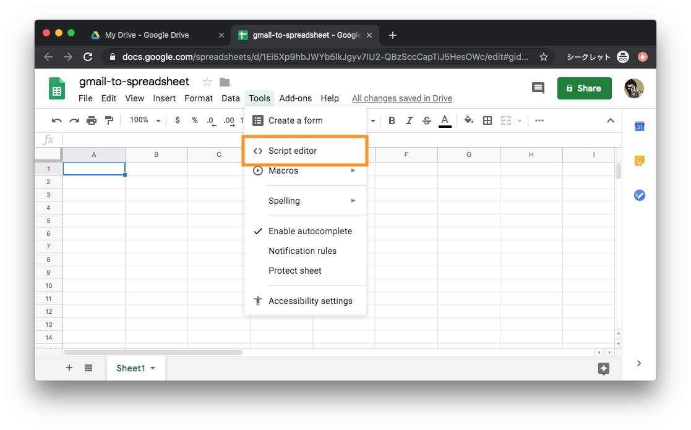
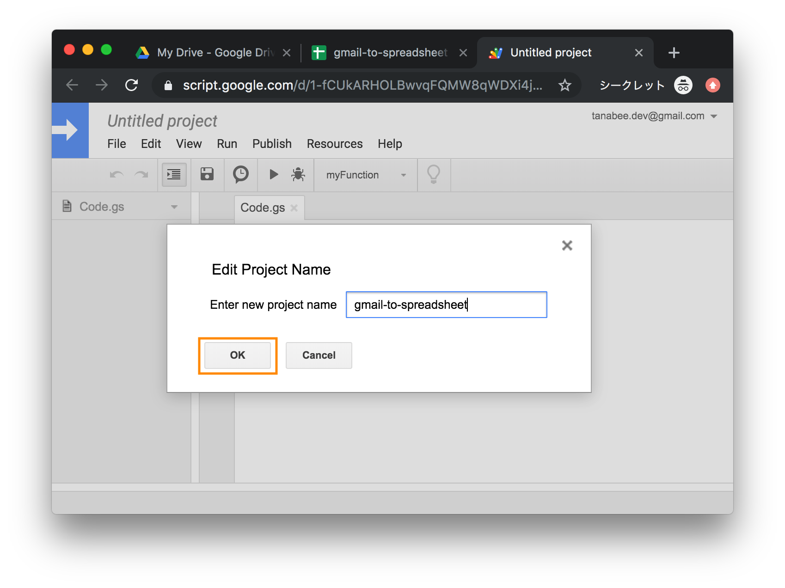
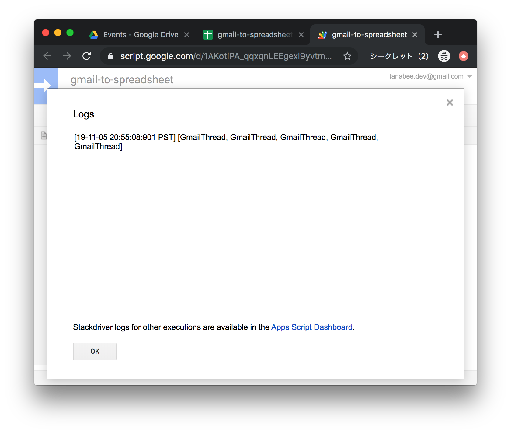
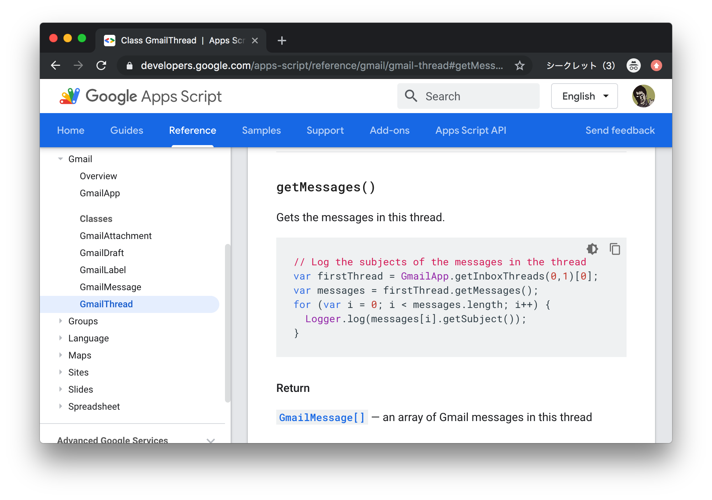
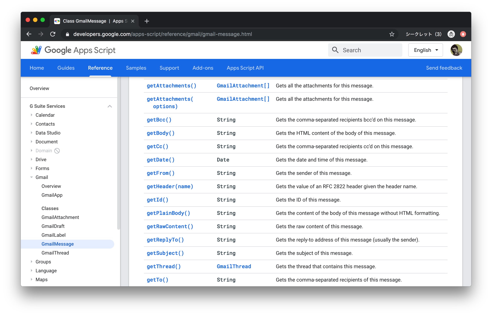
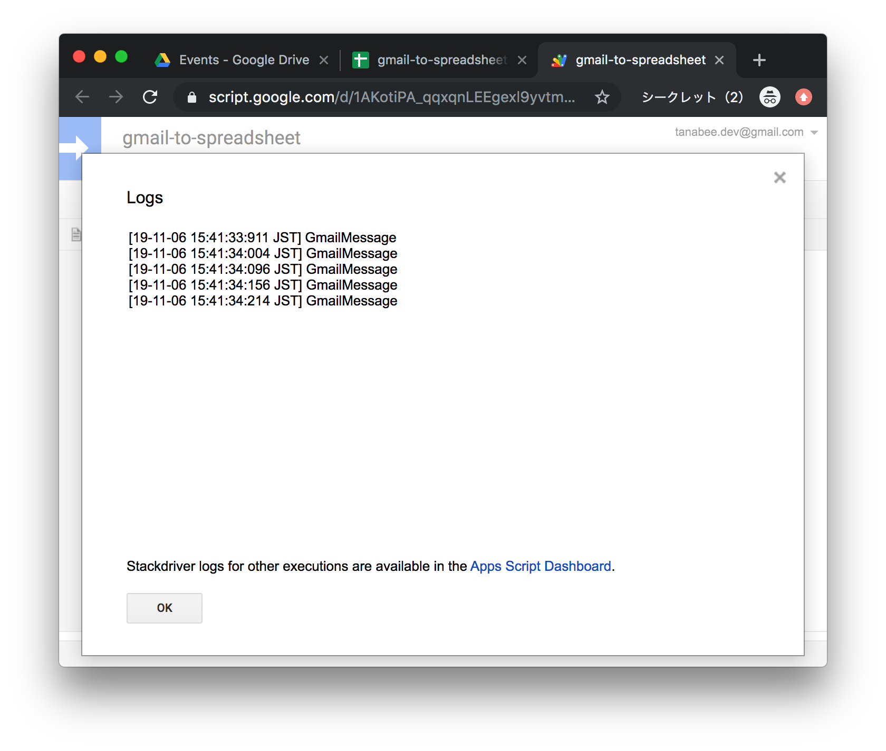
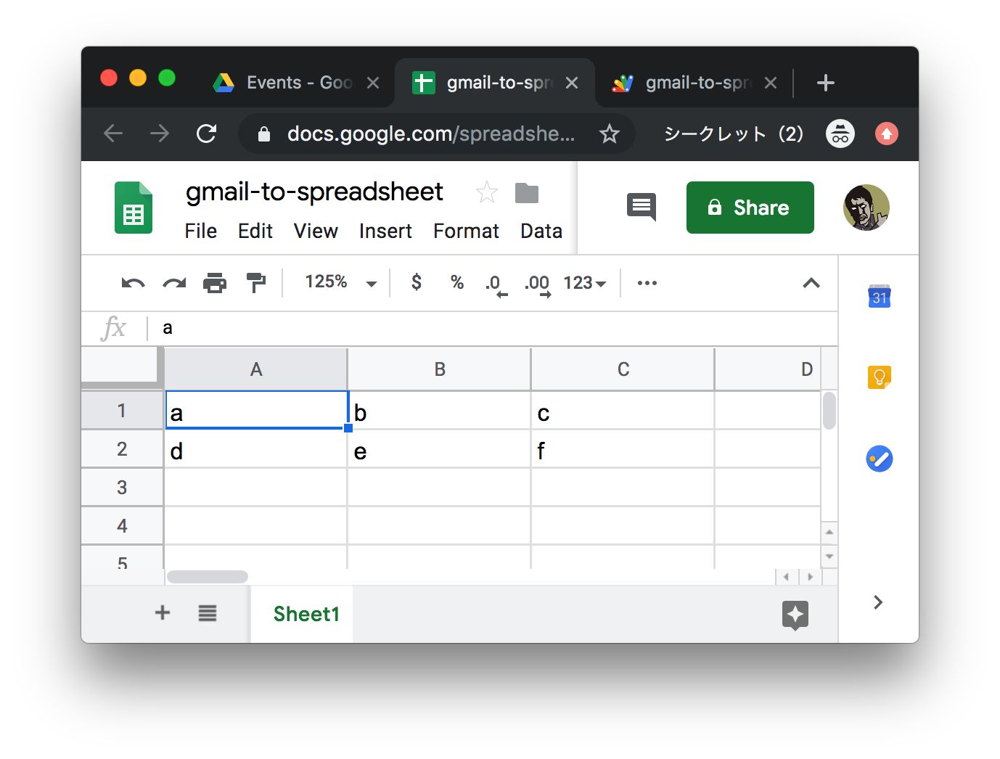
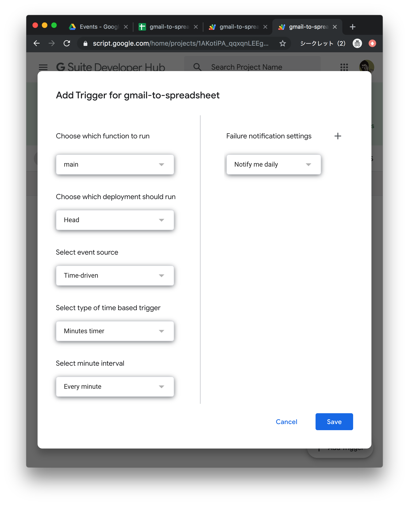
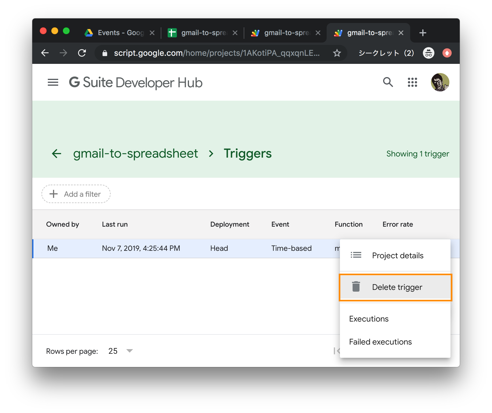

author: Yuki Tanabe
summary: Apps Script ハンズオン
id: ja
categories: apps-script,gsuite,javascript
environments: Web
status: Draft
analytics account: UA-141719032-2
feedback link: https://github.com/tanabee/gas-codelab/issues

# Apps Script ハンズオン

## 概要

この Codelab では、 Google Apps Script を用いて Gmail のメッセージ一覧を Google Spreadsheet に抽出するアプリケーションを作成します。


### 対象者

- Google Apps Script 初心者
- JavaScript 経験者

### ユースケース

この Codelab は以下のようなケースを想定しています。

- 特定のメーリス、もしくはメールアドレスへのユーザーからの問い合わせの集計、分析
- REST API は提供していないがメール通知機能を提供しているアプリケーションとのシステム連携

## 準備

Gmail もしくは G Suite のアカウントが必要です。もしまだアカウントがない場合には [Gmail アカウントを作成](https://accounts.google.com/signup)してください。

Negative
: Gmail アカウントを作成した場合には、以下の手順に沿ってください。

### 1. mail-to-me アプリケーションを開く

[mail-to-me](https://script.google.com/d/1p2B0NwXg3APMc-nh-fRWuMX6P_W5eQijsi4CVEHLOOq7_zJmQbWyZAWl/edit?usp=sharing) アプリケーションをブラウザで開く。

### 2. コピーを作成

**File** > **Make a Copy** を選択。

### 3. mail-to-me の実行

**Run** ボタンをクリック。

### 4. Gmail を確認

[Gmail](https://mail.google.com) をブラウザで開き、メールが受信されていることを確認する。以上で準備は完了です。

## プロジェクトの作成

Apps Script のプロジェクトを作成しましょう。まず [drive.google.com](https://drive.google.com) にアクセスし、スプレッドシートファイルを作成します。


**New** をクリック


**Google Sheets** を選択するとスプレッドシートファイルが作成されます。


ファイル名を選択し、ファイル名（gmail-to-spreadsheet など）を入力します。


**Tools** > **Script editor** メニューを選択すると Google Apps Script プロジェクトが作成されます。


プロジェクト名を選択し、プロジェクト名（gmail-to-spreadsheet など）を入力します。


プロジェクト名を入力して OK ボタンをクリックするとプロジェクトが保存されます。トーストが表示されてから、非表示になったところで保存が完了します。

これでスクリプトを実行できるようになりました。次のセクションでスクリプトを実行していきます。

## スクリプトの実行

下記のコードをコピーしてスクリプトエディタに貼り付けてください。その後 **Run** ボタンをクリックします。

```JavaScript
function main() {
  Logger.log('Hello Google Apps Script!');
}
```


`Logger.log()` 関数は Google Apps Script のログ出力関数です。


**View** > **Logs** を選択すると出力されたログを確認できます。


`Hello Google Apps Script!` と出力されているのが確認できました。

`console.log()` 関数を使うこともできますが、`console.log()` 関数を利用するためには別の設定が必要になるため、この Codelab では `Logger.log()` 関数を利用します。

## GmailApp クラス

次に、 GmailApp クラスを見てみます。GmailApp クラスとメソッドについては[公式リファレンス](https://developers.google.com/apps-script/reference/) から確認できます。[GmailApp](https://developers.google.com/apps-script/reference/gmail/gmail-app) のドキュメントを見てみます。Gmail に関連するクラス (e.g. [GmailMessage](https://developers.google.com/apps-script/reference/gmail/gmail-message), [GmailThread](https://developers.google.com/apps-script/reference/gmail/gmail-thread) ) やメソッド (e.g. [search](https://developers.google.com/apps-script/reference/gmail/gmail-app#searchquery,-start,-max), [sendEmail](https://developers.google.com/apps-script/reference/gmail/gmail-app#sendemailrecipient,-subject,-body,-options)) が確認できます。


今回は [Gmail.search](https://developers.google.com/apps-script/reference/gmail/gmail-app#searchquery,-start,-max) を使ってメール一覧を取得します。

## GmailThead の取得

ではスクリプトを実装していきます。[Gmail.search](https://developers.google.com/apps-script/reference/gmail/gmail-app#searchquery,-start,-max) メソッドを使って Gmail のスレッド一覧を取得します。

```JavaScript
function main() {
  var searchText = '';// You can set value.
  var threads = GmailApp.search(searchText, 0, 5);
  Logger.log(threads);
}
```

特定のメーリスなど、検索条件を設定したい場合には searchText に値を代入してください。公式サポートページに[検索演算子](https://support.google.com/mail/answer/7190?hl=ja)についてまとめられています。

**Run** ボタンをクリックして実行します。


このスクリプトに Gmail の操作を認可するため、ポップアップが表示されます。Gmail リソースへのアクセスを認可する必要があります。 **Review Permissions** をクリックします。


この Codelab で使っているアカウントを選択します。


このアプリケーションを確認するために、 **Advanced** を選択し **Go to ...** と書かれたリンクをクリックします。もし、この画面が表示されない場合には、この手順はスキップしてください。


このアプリケーションに与える必要のあるスコープが表示されます。 **Allow** ボタンをクリック後、スクリプトエディタに戻ってスクリプトが実行されます。


ログを見てみましょう。GmailThread の配列が出力されています。たった 5 行のコードでメールの一覧を取得して出力することができました！この認可のポップアップのフローのために、通常実装するのが大変な認証周りのコードを書く必要がなくなるため、非常に簡単にアプリケーション連携ができるのです。

## GmailMessage のパース

直前のセクションで Gmail のスレッド一覧を取得できました。今回はメッセージの件名、本文、送信元、送信先、日時を取得します。そのため、GmailThread からそれに紐づくメッセージを取得します。


Apps Script のリファレンスを見てみましょう。 GmailThread クラスには [getMessages()](https://developers.google.com/apps-script/reference/gmail/gmail-thread#getmessages) メソッドが用意されており GmailMessage の配列を返します。 **GmailMessage** のリンクをクリックしてそのメソッドを確認しましょう。


GmailMessage クラスには getSubject, getBody, getFrom, getTo, getDate など多数の取得系メソッドが用意されています。 `GmailThread.getMessages()` を用いて求める値が取得できそうです。

今回はスレッド内の最初のメッセージを使います。メッセージを取得してログを見てみましょう。

```JavaScript
function main() {
  var searchText = '';
  var threads = GmailApp.search(searchText, 0, 5);
  threads.forEach(function (thread) {
    var message = thread.getMessages()[0];
    Logger.log(message);
  });
}
```


**GmailMessage** というテキストが表示されます。

最後に、取得系のメソッドを叩いて値を取得します。

```JavaScript
function main() {
  var searchText = '';
  var threads = GmailApp.search(searchText, 0, 5);
  threads.forEach(function (thread) {
    var message = thread.getMessages()[0];
    Logger.log(message.getSubject());
    Logger.log(message.getFrom());
    Logger.log(message.getTo());
    Logger.log(message.getPlainBody());
    Logger.log(message.getDate());
  });
}
```


スクリプトを実行してログを見てみます。Gmail メッセージの値を取得できました。次のセッションからは、これらの値を Spreadsheet に保存していきます。

## SpreadsheetApp クラス

// TODO: Graph: Spreadsheet > Sheet > Range 

次に、 SpreadsheetApp クラスについて理解します。[SpreadsheetApp reference](https://developers.google.com/apps-script/reference/spreadsheet/spreadsheet-app) にアクセスし、[getActiveSheet](https://developers.google.com/apps-script/reference/spreadsheet/spreadsheet-app#getactivesheet) のセクションを確認します。このメソッドを使うことで作成したスプレッドシートにアクセスすることができます。

下記のメソッドを実行します。Gmail の時と同様に認証の許可が必要です。

```JavaScript
function saveMessages() {
  Logger.log(SpreadsheetApp.getActiveSheet().getName());
}
```


ログビュアーでスプレッドシートのタブ名が表示されます。 Spreadsheet にデータを保存するためには [Range](https://developers.google.com/apps-script/reference/spreadsheet/range) クラスにアクセスし[Range.setValues()](https://developers.google.com/apps-script/reference/spreadsheet/range#setvaluesvalues) を叩く必要があります。

```JavaScript
function saveMessages() {
  var data = [
    ['a', 'b', 'c'],
    ['d', 'e', 'f'],
  ];
  SpreadsheetApp
    .getActiveSheet()
    .getRange("A1:C2")
    .setValues(data);
}
```


`saveMessages` を実行し Spreadsheet を見てみると値が挿入されていることが確認できます。ここで引数に指定したデータが 2 次元配列であることに注意してください。

ここで、データを引数で渡せるように関数を編集します。今回は 5 つのタイプの値を保存するため、列 "E" は固定とします。

```JavaScript
function saveMessages(data) {
  SpreadsheetApp
    .getActiveSheet()
    .getRange("A1:E" + data.length)
    .setValues(data);
}
```

外から叩くためのテストとして、 `test` 関数を実装し、実行してみます。

```JavaScript
function test() {
  var data = [
    ['a', 'b', 'c', 'd', 'e'],
    ['f', 'g', 'h', 'i', 'j'],
    ['A', 'B', 'C', 'D', 'E'],
    ['F', 'G', 'H', 'I', 'J'],
  ];
  saveMessages(data);
}
```


無事に `saveMessages` 関数を叩けて Spreadsheet に値が挿入されました。テストできたので test 関数を削除します。次のセクションでは `main` 関数から `saveMessages` 関数を叩いて Gmail のメッセージ一覧を保存します。

## メッセージを Spreadsheet に保存

`saveMessages` 関数を叩けるように `main` 関数を更新します。 `messages` の値を 2 次元配列になるようにします。

```JavaScript
function main() {
  var searchText = '';
  var threads = GmailApp.search(searchText, 0, 5);
  var messages = [];
  threads.forEach(function (thread) {
    var message = thread.getMessages()[0];
    // single cell characters limit
    if (message.getPlainBody().length > 50000) {
      return;
    }
    messages.push([
      message.getSubject(),
      message.getFrom(),
      message.getTo(),
      message.getPlainBody(),
      message.getDate(),
    ]);
  });
  saveMessages(messages);
}

function saveMessages(data) {
  SpreadsheetApp
    .getActiveSheet()
    .getRange("A1:E" + data.length)
    .setValues(data);
}
```

`main` 関数を実行し、Spreadsheet を確認します。


Spreadsheet で Gmail メッセージのデータを確認できました。それぞれの列が何を示すのか理解しやすくするために、最初の列に列名を指定します。コードの 4 行目で messages を定義している行を以下に書き換えて実行します。

```JavaScript
  var messages = [['Subject', 'From', 'To', 'Body', 'Date']];
```


列の意味がわかりやすくなりました。30 行に満たないコードで Gmail と Spreadsheet を連携するアプリケーションを作成することができました！

## Spreadsheet のカスタムメニュー

これまで作ったアプリケーションで十分要件を満たしますが、これをもっと使いやすくすることができます。 Spreadsheet にカスタムメニューを追加し、それを選択することで Gmail からメッセージ一覧を取得できるようにします。下記の `onOpen` 関数を追加し実行します。 `onOpen` という関数名は予約されており、Spreadsheet が開かれるタイミングで呼ばれます。詳しくは [公式ドキュメント](https://developers.google.com/apps-script/guides/triggers#onopene) で確認できます。

```JavaScript
function onOpen() {
  SpreadsheetApp
    .getActiveSpreadsheet()
    .addMenu('Gmail', [
      {name: 'Fetch', functionName: 'main'},
    ]);
}
```


Spreadsheet を見てみましょう。カスタムメニューが表示されます。 **Gmail** > **Fetch** を選択します。

Spreadsheet の値をリセットできるとなおよいでしょう。 `clearSheet` 関数を追加してメニューに追加します。

```JavaScript
function onOpen() {
  SpreadsheetApp
    .getActiveSpreadsheet()
    .addMenu('Gmail', [
      {name: 'Fetch', functionName: 'main'},
      {name: 'Clear sheet', functionName: 'clearSheet'},
    ]);
}

function clearSheet() {
  SpreadsheetApp
    .getActiveSheet()
    .clear();
}
```

**Clear sheet** サブメニューが追加されるので実行してみましょう。

## 自動化

[Trigger](https://developers.google.com/apps-script/guides/triggers/installable) を使って自動化の設定をすることも可能です。 [Time-driven trigger](https://developers.google.com/apps-script/guides/triggers/installable#time-driven_triggers) を設定して `main` 関数を 1 分おきに実行してみましょう。

以下に沿って進めます。


**Edit** > **Current project's trigger** を選択します


**Add Trigger** を選択します


ポップアップが表示されるので Trigger の設定を行います。上の画像の通り設定して **Save** ボタンを選択します。


トリガーが作成されました！ドットアイコンを選択します。


**Executions** を選択します。


`main` 関数が 1 分おきに実行されているのが確認できます。新しいメッセージを受信した際でも最新の状態を保つことができます。


ドットアイコン > **Delete trigger** を選択することで Trigger を削除できます。


Google Apps Script には様々な種類の Trigger が用意されています。 Trigger を使うことでプロジェクトをより便利にすることができます。

## Congrats!

おめでとうございます！この Codelab は以上で終了です。最終的なコードは以下で確認できます。また [tanabee/gas-codelab](https://github.com/tanabee/gas-codelab) の GitHub にも上がっています。

```JavaScript
function onOpen() {
  SpreadsheetApp
    .getActiveSpreadsheet()
    .addMenu('Gmail', [
      {name: 'Fetch', functionName: 'main'},
      {name: 'Clear sheet', functionName: 'clearSheet'},
    ]);
}

function main() {
  var searchText = '';
  var threads = GmailApp.search(searchText, 0, 500);
  var messages = [['Subject', 'From', 'To', 'Body', 'Date']];
  threads.forEach(function (thread) {
    var message = thread.getMessages()[0];
    // single cell characters limit
    if (message.getPlainBody().length > 50000) {
      return;
    }
    messages.push([
      message.getSubject(),
      message.getFrom(),
      message.getTo(),
      message.getPlainBody(),
      message.getDate(),
    ]);
  });
  saveMessages(messages);
}

function saveMessages(data) {
  clearSheet();
  SpreadsheetApp
    .getActiveSheet()
    .getRange("A1:E" + data.length)
    .setValues(data);
}

function clearSheet() {
  SpreadsheetApp
    .getActiveSheet()
    .clear();
}
```

### Next Action

このプロジェクトをより便利にするアイデアを載せておきます。

- 500 件以上の Gmail メッセージの取得 (for 文を使って)
- Spreadsheet への保存を上書きでなく追加する形式にする
- フォームの送信結果など固定フォーマットの本文を解析して保存する
- [Data Studio](https://datastudio.google.com) を使った見える化
