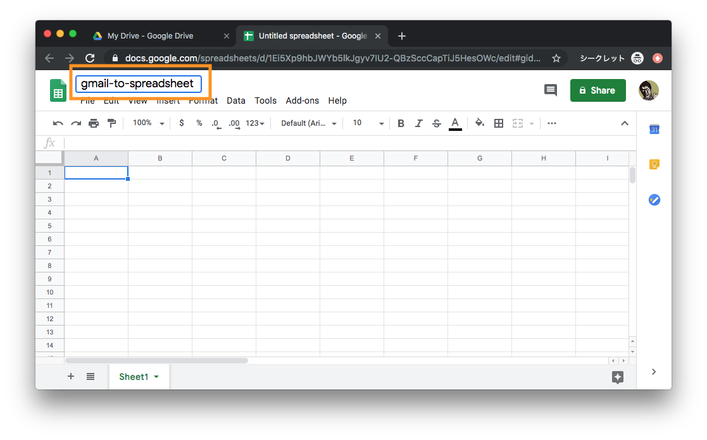
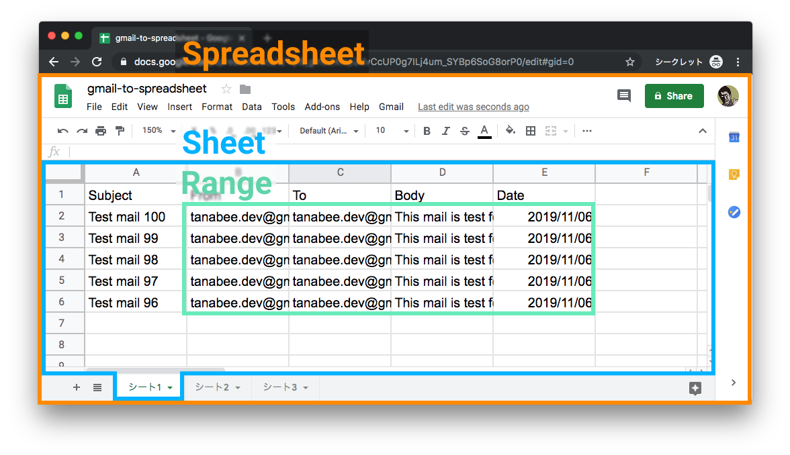
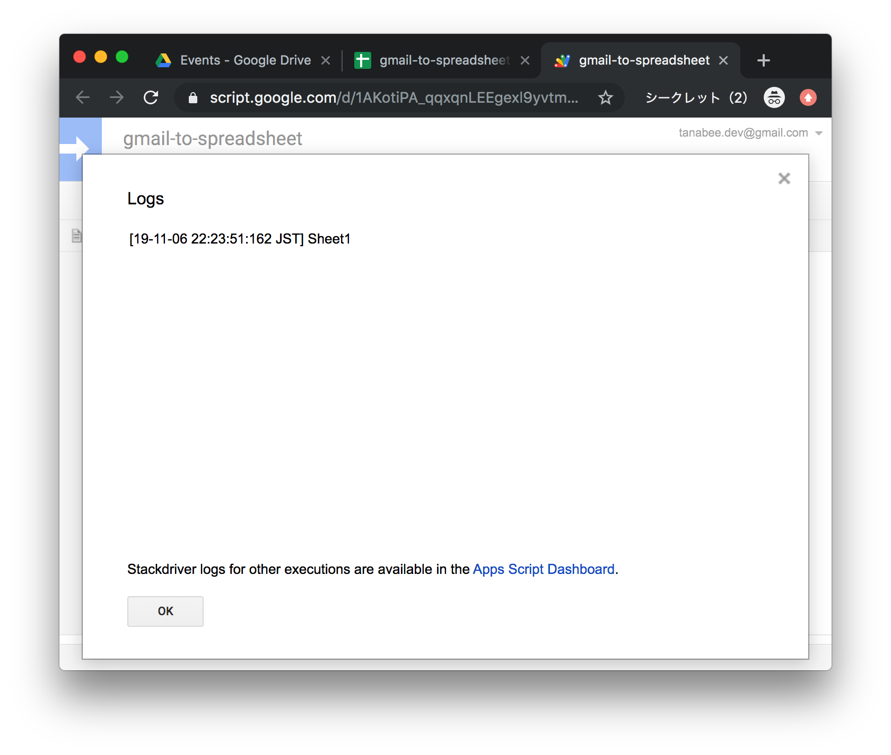
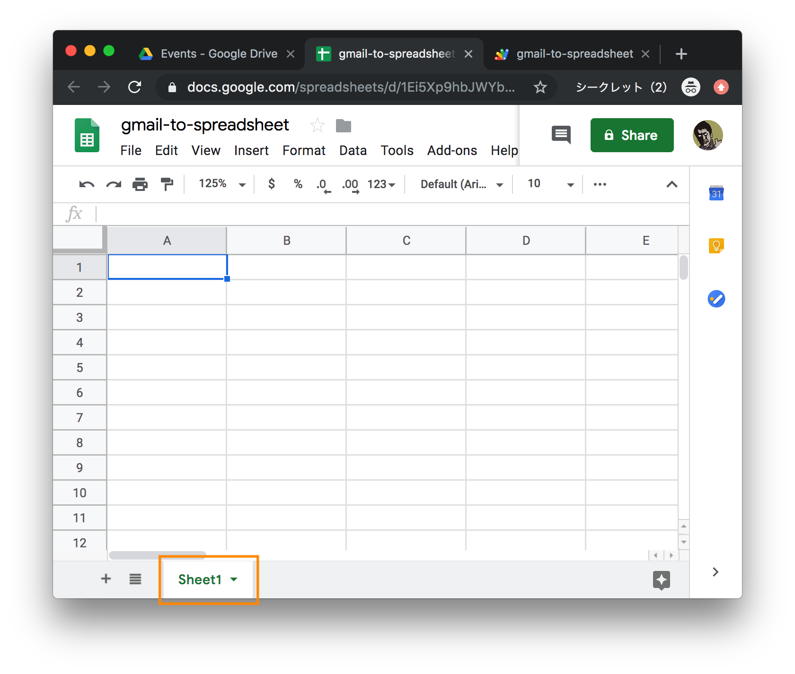
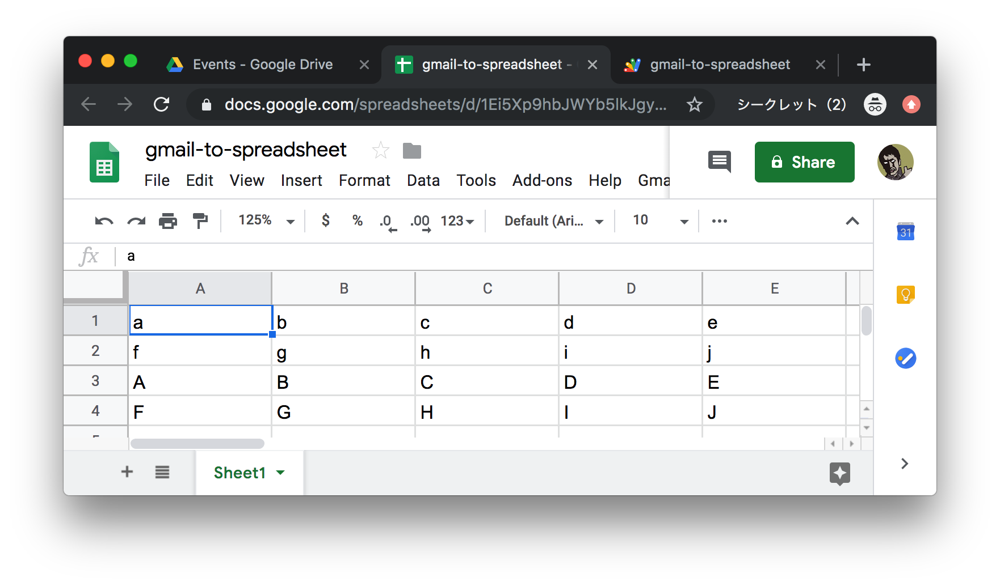

author: Yuki Tanabe
summary: Apps Script Hands-on
id: en
categories: apps-script,gsuite,javascript
environments: Web
status: Draft
analytics account: UA-141719032-2
feedback link: https://github.com/tanabee/gas-codelab/issues

# Apps Script Hands-on

## Intro
Duration: 0:01:00

In this codelab, you can make a application that exports Gmail messages to Google Spreadsheet using Google Apps Script.


### Source Code

You can get complete source code at [tanabee/gas-codelab](https://github.com/tanabee/gas-codelab) in GitHub.

### Target

- Beginner of Apps Script
- Experts of JavaScript

### Use case

- Analysis of the user inquiries about specific websites sent to specific mailing list or email addresses
- Integrate Google Apps with a system that doesn't provide REST API and provides email notifications

## Preparation
Duration: 0:01:00

You need own Gmail or G Suite account. Please [create Gmail account](https://accounts.google.com/signup) if you don't have.

Negative
: If you use Gmail for the first time, you need to follow below

### 1. Open mail-to-me application

Open the application in your browser.
[mail-to-me](https://script.google.com/d/1p2B0NwXg3APMc-nh-fRWuMX6P_W5eQijsi4CVEHLOOq7_zJmQbWyZAWl/edit?usp=sharing)

### 2. Make a copy

Select **File** > **Make a Copy**.

### 3. Run mail-to-me

Select **Run** button.

### 4. Confirm your Gmail

Open [Gmail](https://mail.google.com) in your browser and confirm to receive emails. It's completed preparation.

## Create project
Duration: 0:02:00

Let's create a Apps Script project. First, visit [drive.google.com](https://drive.google.com) and create a Spreadsheet file.


Click **New**


Click **Google Sheets** and Spreadsheet file will be created.


Click file name area, and input file name. (e.g. gmail-to-spreadsheet)


Select **Tools** > **Script editor** menu, and Google Apps Script project will be created.


Click project name area, and input project name. (e.g. gmail-to-spreadsheet)


After inputting project name, Click OK and it will be saved. Then a toast appears. The project will complete to be saved when the toast disappears.

Now, we can run the script! We will run the script in the next section.

## Run script
Duration: 0:02:00

Copy the script below and paste to the Script editor, and click **Run** button.

```JavaScript
function main() {
  Logger.log('Hello Google Apps Script!');
}
```


`Logger.log()` is logging function in Google Apps Script.


You can view logs when you select **View** > **Logs** in the menu.


We can find the text `Hello Google Apps Script!` in Log Viewer.

We can also use `console.log()`, but we use `Logger.log()` in this Hands-on because you need an additional process to use `console.log()`.

## GmailApp class
Duration: 0:03:00

Next, see the GmailApp class. Confirm GmailApp classes and methods in [official reference](https://developers.google.com/apps-script/reference/). See [GmailApp document](https://developers.google.com/apps-script/reference/gmail/gmail-app). You can see the classes (e.g. [GmailMessage](https://developers.google.com/apps-script/reference/gmail/gmail-message), [GmailThread](https://developers.google.com/apps-script/reference/gmail/gmail-thread) ) and the methods (e.g. [search](https://developers.google.com/apps-script/reference/gmail/gmail-app#searchquery,-start,-max), [sendEmail](https://developers.google.com/apps-script/reference/gmail/gmail-app#sendemailrecipient,-subject,-body,-options)) related to Gmail.


We use [search](https://developers.google.com/apps-script/reference/gmail/gmail-app#searchquery,-start,-max) method for retrieving emails in this time.

## Retrieve Gmail threads
Duration: 0:03:00

Let's implement the script. Use `GmailApp.search` method and retrieve Gmail threads.

```JavaScript
function main() {
  var searchText = '';// You can set value.
  var threads = GmailApp.search(searchText, 0, 5);
  Logger.log(threads);
}
```

If you would like to apply search filters, you can assign value to searchText. You can confirm search operators [here](https://support.google.com/mail/answer/7190?hl=en).

Click **Run** button.


Then an authorization popup will be shown. You need to allow this project to access Gmail resources. Click **Review Permissions**.


Choose an account that you are using in this codelab.


To verify this app, click **Advanced** and click the bottom link **Go to ...**. If it doesn't be displayed, skip this step.


Then the scope you need to allow is displayed. Click **Allow** button. It will go back to Script editor and run the script.


See the logs. Then you can see Array of GmailThread. You succeeded to retrieve emails and output the logs for only 5 lines of code! Because of this popup authorization flow, you don't need to implement authorization codes and you can make it easier than ever.

## Parse Gmail messages
Duration: 0:03:00

In the previous section, we could retrieve Gmail threads. We'd like to retrieve the message subject, body, from, to, and date in this time. So, we need to get messages from `GmailThread`.


Visit Apps Script reference. GmailThread class has [getMessages()](https://developers.google.com/apps-script/reference/gmail/gmail-thread#getmessages) method and it returns Array of GmailMessage. Click **GmailMessagge** link and see the methods.


it has getSubject, getBody, getFrom, getTo, getDate and many retrieving methods. We can get values we want using `GmailThread.getMessages()`.

In this time, we use the first message of the threads. Retrieve message and show logs.

```JavaScript
function main() {
  var searchText = '';
  var threads = GmailApp.search(searchText, 0, 5);
  threads.forEach(function (thread) {
    var message = thread.getMessages()[0];
    Logger.log(message);
  });
}
```


You can see the text **GmailMessage** in log viewer.

Finaly, get values to call methods.

```JavaScript
function main() {
  var searchText = '';
  var threads = GmailApp.search(searchText, 0, 5);
  threads.forEach(function (thread) {
    var message = thread.getMessages()[0];
    Logger.log(message.getSubject());
    Logger.log(message.getFrom());
    Logger.log(message.getTo());
    Logger.log(message.getPlainBody());
    Logger.log(message.getDate());
  });
}
```


Run the script and See the logs. You succeeded to retrieve Gmail message values! From Next section, we will insert these values to Spreadsheet.

## SpreadsheetApp class
Duration: 0:03:00

Next, let's understand SpreadsheetApp class. Visit [SpreadsheetApp reference](https://developers.google.com/apps-script/reference/spreadsheet/spreadsheet-app) and see [getActiveSheet](https://developers.google.com/apps-script/reference/spreadsheet/spreadsheet-app#getactivesheet) method section. You can access the Spreadsheet you created to use this method.


SpreadsheetApp has hierarchical structured classes. ( Spreadsheet > Sheet > Range )

Run this method below. You need to allow the authorization just like in Gmail.

```JavaScript
function saveMessages() {
  Logger.log(SpreadsheetApp.getActiveSheet().getName());
}
```



You can see the Spreadsheet tab name in the log viewer. You need to access [Range](https://developers.google.com/apps-script/reference/spreadsheet/range) class to insert data into the sheet. Use [Range.setValues()](https://developers.google.com/apps-script/reference/spreadsheet/range#setvaluesvalues) to insert messages.

```JavaScript
function saveMessages() {
  var data = [
    ['a', 'b', 'c'],
    ['d', 'e', 'f'],
  ];
  SpreadsheetApp
    .getActiveSheet()
    .getRange("A1:C2")
    .setValues(data);
}
```


Run `saveMessages` and see the Spreadsheet. Then, You can see the values inserted into the sheet. Note that the argument must be a two-dimensional array.

Then, update this function to set data as argument of this method. We'd like to insert 5 types of values, so we set the last column to "E".

```JavaScript
function saveMessages(data) {
  SpreadsheetApp
    .getActiveSheet()
    .getRange("A1:E" + data.length)
    .setValues(data);
}
```

Add test function and Run it.

```JavaScript
function test() {
  var data = [
    ['a', 'b', 'c', 'd', 'e'],
    ['f', 'g', 'h', 'i', 'j'],
    ['A', 'B', 'C', 'D', 'E'],
    ['F', 'G', 'H', 'I', 'J'],
  ];
  saveMessages(data);
}
```


Done! Now, you can delete test method. We will call `saveMessages` function from `main` function from the next section.

## Save emails to Spreadsheet
Duration: 0:03:00

Update `main` function to call `saveMessages` function. Make `messages` variable as two-dimensional array.

```JavaScript
function main() {
  var searchText = '';
  var threads = GmailApp.search(searchText, 0, 5);
  var messages = [];
  threads.forEach(function (thread) {
    var message = thread.getMessages()[0];
    // single cell characters limit
    if (message.getPlainBody().length > 50000) {
      return;
    }
    messages.push([
      message.getSubject(),
      message.getFrom(),
      message.getTo(),
      message.getPlainBody(),
      message.getDate(),
    ]);
  });
  saveMessages(messages);
}

function saveMessages(data) {
  SpreadsheetApp
    .getActiveSheet()
    .getRange("A1:E" + data.length)
    .setValues(data);
}
```

Run `main` function and see the Spreadsheet.


You can see the messages data in the Spreadsheet! Although, it is better that the first row is filled with column names to understand these columns easier. Replace 4th row of the code as below and run the script.

```JavaScript
  var messages = [['Subject', 'From', 'To', 'Body', 'Date']];
```


We can understand the meaning of the eash column well. Now, we succeeded to make the application that can connect Gmail and Spreadsheet, and it is less than 30 lines of code.

## Custom Menu of Spreadsheet
Duration: 0:03:00

The application we made works well, but we can make it more convenient. We will add custom menu on Spreadsheet. Add the `onOpen` function below and Run it. The name `onOpen` is reserved and will be called when the Spreadsheet is opened. You can confirm the details in the [official document](https://developers.google.com/apps-script/guides/triggers#onopene).

```JavaScript
function onOpen() {
  SpreadsheetApp
    .getActiveSpreadsheet()
    .addMenu('Gmail', [
      {name: 'Fetch', functionName: 'main'},
    ]);
}
```


See the Spreadsheet. The custom menu will be displayed. Click **Gmail** > **Fetch**.

It's better that it can be operated to reset the sheet values. Add `clearSheet` function and add menu.

```JavaScript
function onOpen() {
  SpreadsheetApp
    .getActiveSpreadsheet()
    .addMenu('Gmail', [
      {name: 'Fetch', functionName: 'main'},
      {name: 'Clear sheet', functionName: 'clearSheet'},
    ]);
}

function clearSheet() {
  SpreadsheetApp
    .getActiveSheet()
    .clear();
}
```

You can see **Clear sheet** sub menu and run it.

## Automation
Duration: 0:04:00

You can also configure automation to this project using [Trigger](https://developers.google.com/apps-script/guides/triggers/installable). Let's try setting [Time-driven trigger](https://developers.google.com/apps-script/guides/triggers/installable#time-driven_triggers) to run the `main` function once a minute.

Follow below.


Select **Edit** > **Current project's trigger**


Select **Add Trigger**


Then it will be displayed the popup of trigger settings. Select as screenshot above and Click **Save**.


Then the trigger is created. Click the three dots icon.


Select **Executions**.


You can see that `main` function is executed once a minute. If you receive new Gmail messages, the spreadsheet can be refreshed as the latest status.


You can delete trigger to select the three dots icon and **Delete trigger**.


Google Apps Script has many types of triggers. You can improve the projects more convenient to use triggers.

## Congrats!
Duration: 0:01:00

Congrats! You finished this codelab. You can see the final project code below. You can also get code at [tanabee/gas-codelab](https://github.com/tanabee/gas-codelab) in GitHub.

```JavaScript
function onOpen() {
  SpreadsheetApp
    .getActiveSpreadsheet()
    .addMenu('Gmail', [
      {name: 'Fetch', functionName: 'main'},
      {name: 'Clear sheet', functionName: 'clearSheet'},
    ]);
}

function main() {
  var searchText = '';
  var threads = GmailApp.search(searchText, 0, 500);
  var messages = [['Subject', 'From', 'To', 'Body', 'Date']];
  threads.forEach(function (thread) {
    var message = thread.getMessages()[0];
    // single cell characters limit
    if (message.getPlainBody().length > 50000) {
      return;
    }
    messages.push([
      message.getSubject(),
      message.getFrom(),
      message.getTo(),
      message.getPlainBody(),
      message.getDate(),
    ]);
  });
  saveMessages(messages);
}

function saveMessages(data) {
  clearSheet();
  SpreadsheetApp
    .getActiveSheet()
    .getRange("A1:E" + data.length)
    .setValues(data);
}

function clearSheet() {
  SpreadsheetApp
    .getActiveSheet()
    .clear();
}
```

### Next Action

You can improve this project. I'll show you some examples.

- Retrieve Over 500 Gmail threads (Using for statement)
- Not overwrite but add the messages to Spreadsheet
- Parse specific formatted message body and save the elements
- Visualize the data using [Data Studio](https://datastudio.google.com)
